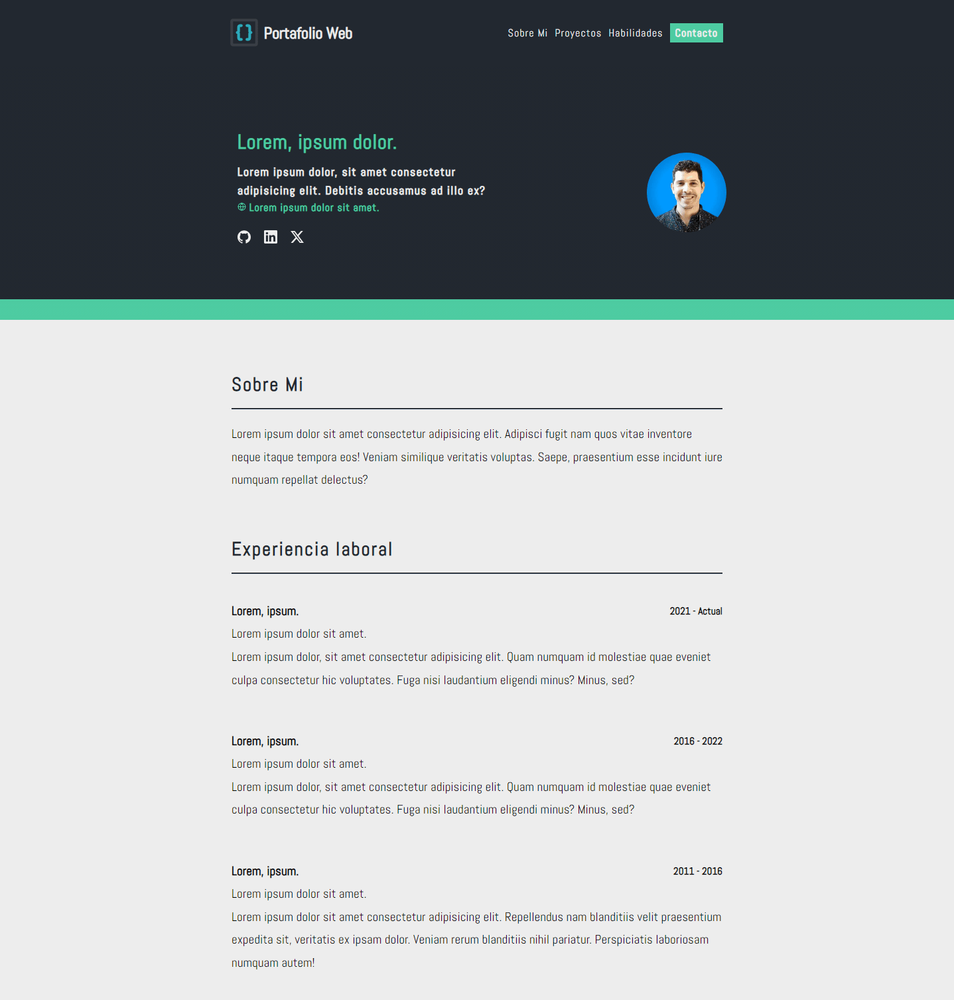
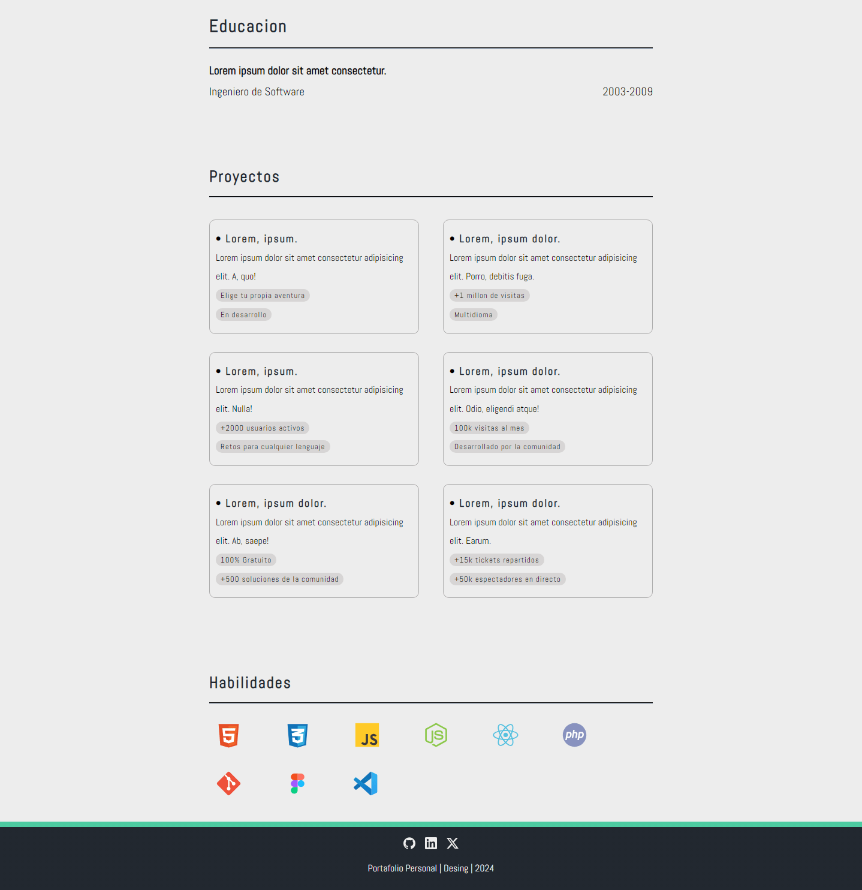

# 🔵 Portafolio minimalista 

Replica de un Portafolio minimalista aplicando un poco de estilo basico y diferente al original, la practica fue realizada con el fin de aplicar mis conocimientos en las tecnologias basicas del desarrollo de sitios web.

Diseño orginal de [Bartosz Jarocki](https://github.com/BartoszJarocki/cv)

Basado en el diseño de [midudev](https://github.com/midudev/minimalist-portfolio-json?tab=readme-ov-file)

</img>

</img>

### 🔸Tecnologias Utilizadas
- **HTML5:** Para la estructura del contenido.

- **CSS3:** Para el diseño y estilo visual.

- **CSS Flexbox:** Herramientas para diseños responsivos.

¡Gracias por visitar mi trabajo!
